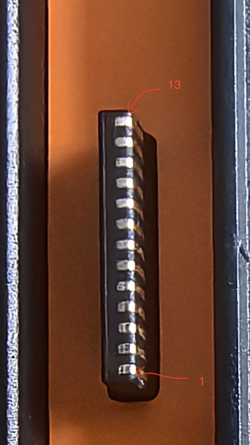
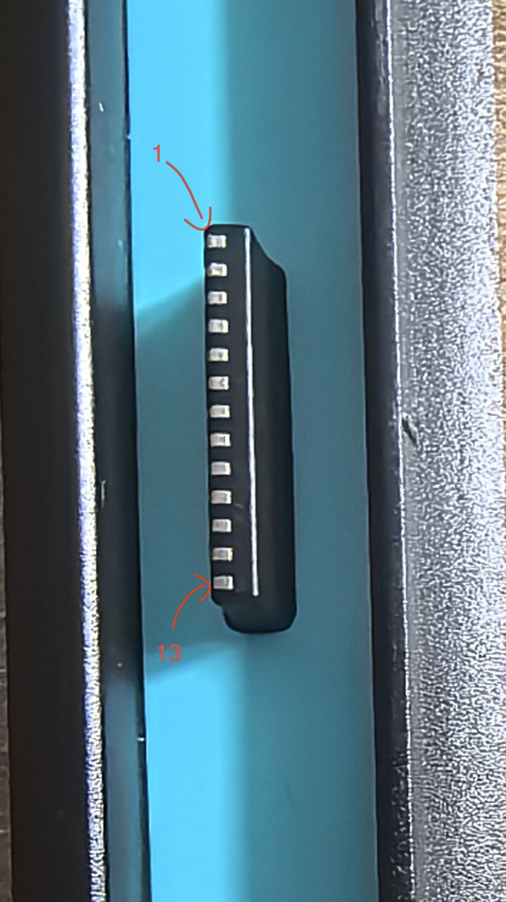
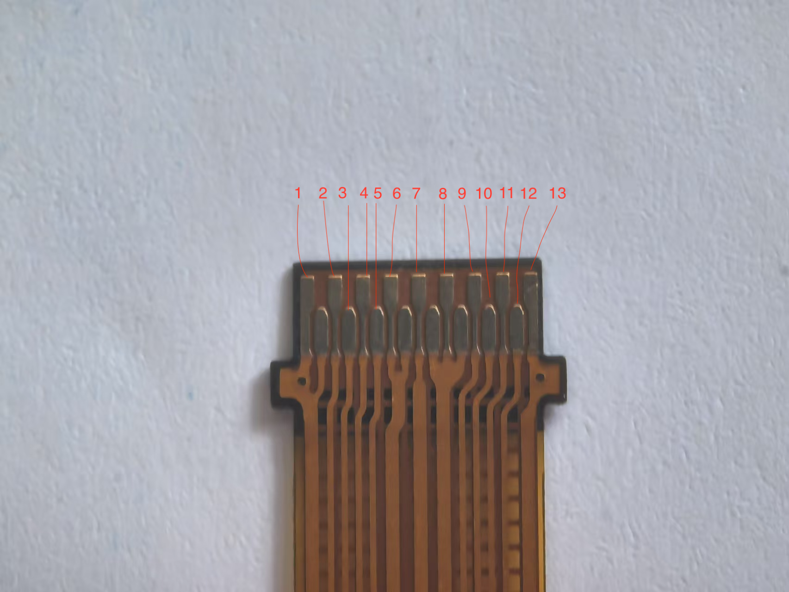

# Switch2 Joy-Con Reverse Engineering
I try to share my reverse engineering information about Switch2 and Joy-Con2 here, and hope this information can be helpful to the Nintendo Switch community.

### Pin mapping

      

  
  
  

    

### Console Connector Pinout

| Left Connector Pin | Right Connector Pin|           Function            |                                                       Funtion                                                                       |
|:------------------:|:------------------:|:-----------------------------:| ----------------------------------------------------------------------------------------------------------------------------------- |
|           1        |         13         |              GND              |                                                          -                                                                          |
|           2        |         12         |              JRST             |                                   Flow Control, console may send to Joycon when LOW                                                 |
|           3        |         11         |               -               |                                                          -                                                                          |
|           4        |         10         |               -               |                                                          -                                                                          |
|           5        |          9         |               -               |                                                          -                                                                          |
|           6        |          8         |               -               |                                                          -                                                                          |
|           7        |          7         |               -               |                                                          -                                                                          |
|           8        |          6         |              5V               |                                              Joy-Con power and charging                                                             |
|           9        |          5         |               -               |                                                          -                                                                          |
|          10        |          4         |               -               |                                                          -                                                                          |
|          11        |          3         |               -               |                                                          -                                                                          |
|          12        |          2         |              Jdet             |                                          Attach detect(needs to be connected to GND)                                                |
|          13        |          1         |              GND              |                                                          -                                                                          |

